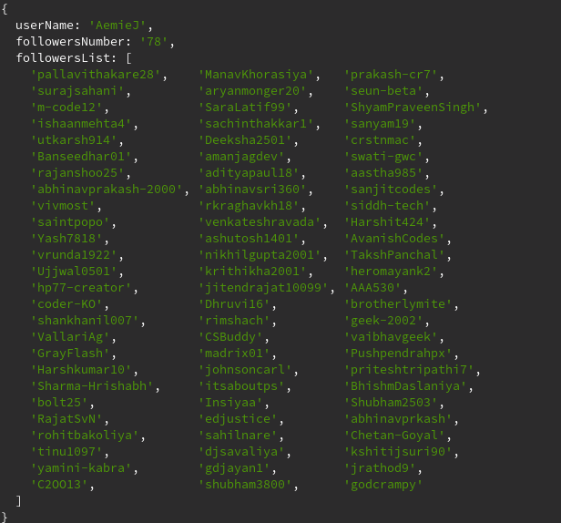

# Unfollowers tracking on Github 
`in-progress`

A chrome extension that will be triggered each time a decrease in follower count is observed for the user. Additional options for continuous periodic tracking of your followers will also be provided. 

Currently, this is a work in progress and it has a script that returns a json object which includes the username, number of followers and list of followers. 

## Prerequisties 
1. Node
2. Yarn 

## Instructions 

If you want to avoid checking the status of your github followers, perform the following steps: 
1. Clone the repository
2. `yarn install`: To include all the packages used. 
3. `cd scripts`: Includes every script that will be used for the project. 
> Currently only `create.js` has been written which provides the json object as the output. 
4. `node create.js <username>`: Here, the username is to be replaced with a github username. 

## Output 
1. `node create.js AemieJ` 

## Author 
* [Aemie Jariwala](https://github.com/AemieJ) - A growing open source developer.